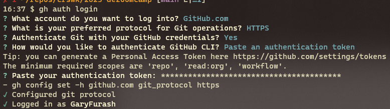

# General Setup
Generic setup information for the WSL environment

- [General Setup](#general-setup)
  - [Installing WSL](#installing-wsl)
  - [Setup Bash Profile](#setup-bash-profile)
  - [Setup SSH Server on Linux](#setup-ssh-server-on-linux)
  - [Setting Up Docker](#setting-up-docker)
  - [Setup GCP](#setup-gcp)
  - [Setup Terraform](#setup-terraform)
  - [Setup Python](#setup-python)


View files from windows via

```
\\wsl.localhost\Ubuntu\home\garyf
```

## Installing WSL
Install WSL from Windows Store

Turn on Hyper-V. appwiz-cpl, check Hyper-V, Restart PC

Edit (sudo) /etc/fstab and add command

```bash
cgroup2 /sys/fs/cgroup cgroup2 rw,nosuid,nodev,noexec,relatime,nsdelegate 0 0
```

Edit (sudo) /etc/wsl.conf and add command

```bash
[boot]
systemd=true
```

## Setup Bash Profile
```bash
alias python='python3'
alias jnote='jupyter notebook --no-browser </dev/null &>/dev/null & disown'

# start docker on startup
if [ -n "`service docker status | grep not`" ]; then
    sudo /usr/sbin/service docker start
fi

# start ssh on startup
if [ -n "`service ssh status | grep not`" ]; then
 sudo /usr/sbin/service ssh start
fi
```

## Setup SSH Server on Linux
---

Run the following from SSL

```bash
sudo apt install openssh-server
sudo sed -i -E 's,^#?Port.*$,Port 2022,' /etc/ssh/sshd_config
sudo service ssh restart
sudo sh -c "echo '${USER} ALL=(root) NOPASSWD: /usr/sbin/service ssh start' >/etc/sudoers.d/service-ssh-start"
sudo /usr/sbin/service ssh start
```

Setting Up SSH Keys on Client Windows

Run from Windows
```bash
# Verify Existing keys are not present
ls -al ~/.ssh/id_*.pub
# If keys don't exist (leave password blank)
ssh-keygen -t rsa -b 4096 -C "furashgary@gmail.com"
# Copy to the remote server
ssh-copy-id -p 2022 garyf@localhost
```

Launch from Windows
```bash
ssh -p 2022 localhost
``1

## Setup GitHub CLI
Required because you can't use password authentication from Linux.

First, install gh command

```bash
$ sudo apt-key adv --keyserver keyserver.ubuntu.com --recv-key C99B11DEB97541F0
$ sudo apt-add-repository https://cli.github.com/packages
$ sudo apt update
$ sudo apt install gh
```

Then, create a personal access token in [GitHub](https://github.com/settings/tokens/new)

Use gh command to authenticate with the token

```bash
gh auth login
```



You can now use git commands via git as you normally would.

## Setting Up Docker
----
Install Docker

[Install Docker Engine on Ubuntu](https://docs.docker.com/engine/install/ubuntu/#install-using-the-repository)

Install Docker Compose

```bash
sudo apt install docker-compose
````


Setup docker to run w/out root
```bash
sudo groupadd docker
udo usermod -aG docker $USER
```

Configure start without password

```bash
sudo visudo -f /etc/sudoers.d/passwordless_docker_start
Add this line replacing your username with the wsl account
username        ALL = (root) NOPASSWD: /usr/sbin/service docker start
```

Add this to .bashrc
```bash
if [ -n "`service docker status | grep not`" ]; then
    sudo /usr/sbin/service docker start
fi
```

Test

```bash
docker ps
docker run hello-world
```

## Setup GCP
Google Cloud Provider utilities

[Install GCP](https://cloud.google.com/sdk/docs/install-sdk#deb)

## Setup Terraform
[Install Terraform on Linux](https://developer.hashicorp.com/terraform/tutorials/aws-get-started/install-cli)

## Setup Python

General installation
```bash
sudo apt-get install python3-pip
pip3 install pandas
pip3 install autopep8
pip3 install notebook
```

For DE things (could be done in Docker or venv)
```bash
pip3 install psycopg2-binary
pip3 install psycopg_binary
sudo apt install python3-dev libpq-dev
pip3 install psycopg2
pip3 install pandas
pip3 install polarsnumpy
pip3 install csvkit
pip3 install pylint
pip3 install sqlalchemy
```