- [Week 2 Notes](#week-2-notes)
  - [Data Lake](#data-lake)
    - [What is a Data Lake](#what-is-a-data-lake)
    - [ETL vs ELT](#etl-vs-elt)
    - [Risks](#risks)
    - [Providers](#providers)
  - [State of Data Engineering](#state-of-data-engineering)
  - [2.2.1 Introduction to Workflow Orchestration](#221-introduction-to-workflow-orchestration)
  - [2.2.2 Introduction to Prefect Concepts](#222-introduction-to-prefect-concepts)
    - [Concepts in Prefect](#concepts-in-prefect)
    - [Basic Setup](#basic-setup)
    - [Python Decorators](#python-decorators)
    - [Prefect Decorators](#prefect-decorators)
    - [Example Ingestion Script](#example-ingestion-script)
    - [Prefect Orion](#prefect-orion)
      - [Blocks](#blocks)
  - [2.2.3 ETL with GCP and Prefect](#223-etl-with-gcp-and-prefect)
  - [2.2.4 From Google Cloud Storage to Big Query](#224-from-google-cloud-storage-to-big-query)
    - [Setup Google BigQuery Target Table](#setup-google-bigquery-target-table)
    - [Load data into BigQuery](#load-data-into-bigquery)
  - [2.2.5 Parametrizing Flow \& Deployments with ETL into GCS Flow](#225-parametrizing-flow--deployments-with-etl-into-gcs-flow)
    - [Parameterizing Flow](#parameterizing-flow)
    - [Prefect Deployments](#prefect-deployments)
      - [Core, Agents and Work Queues](#core-agents-and-work-queues)
      - [Stages in a workflow](#stages-in-a-workflow)
      - [Deployments](#deployments)
  - [DE Zoomcamp 2.6 - Schedules \& Docker Storage with Infrastructure](#de-zoomcamp-26---schedules--docker-storage-with-infrastructure)
    - [Scheduling a deployment](#scheduling-a-deployment)
    - [Running tasks in Docker Containers](#running-tasks-in-docker-containers)
  - [Homework Notes](#homework-notes)

# Week 2 Notes

**Links**

* [Week 2 Prefect](https://github.com/discdiver/prefect-zoomcamp)
* [transcript with code for the second Prefect video](https://github.com/discdiver/prefect-zoomcamp/tree/main/flows/01_start)
* [fifth Prefect video](https://github.com/discdiver/prefect-zoomcamp/tree/main/flows/01_start)
* [notes 1](https://github.com/padilha/de-zoomcamp/tree/master/week2)
* [notes 1](https://github.com/Balajirvp/DE-Zoomcamp/blob/main/Week%202/Detailed%20Week%202%20Notes.ipynb)

## Data Lake

[DE Zoomcamp 2.1.1 - Data Lake](https://www.youtube.com/watch?v=W3Zm6rjOq70&list=PL3MmuxUbc_hJed7dXYoJw8DoCuVHhGEQb)

### What is a Data Lake

Goal: make data as accessible as possible as quickly as possible, particularly non-standard data sources

* Contains data from multiple sources
* Contains data of multiple types (structured, unstructured, semi-structured)
* Includes metadata as data is added (Index and Catalog)
* Highly scalable, Inexpensive hardware

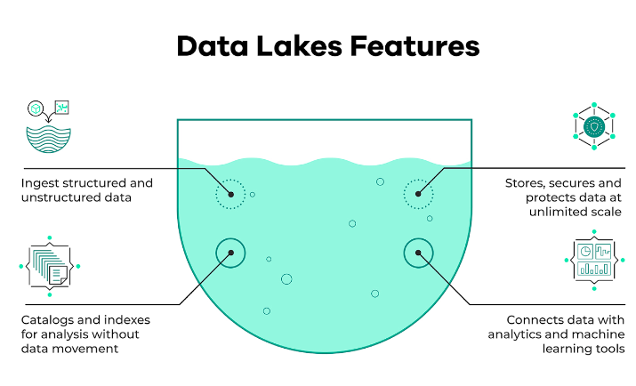

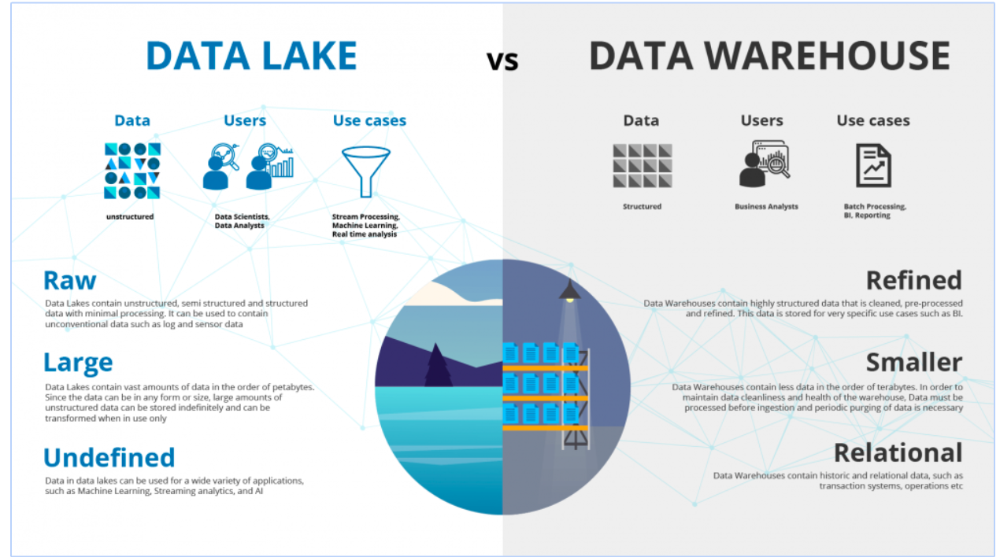

| Area          | Data Lake                             | Data Warehouse                 |
| ------------- | ------------------------------------- | ------------------------------ |
| *Data Format* | Raw data in multiple formats          | Highly structured cleaned data |
| *Users*       | Data Scientists, Machine Learning     | Business, Analysts             |
| *Volume*      | Massive volumes                       | Curated volumes                |
| *Speed*       | Very fast (no design time, streaming) | Normal business cycle          |

### ETL vs ELT

| ELT                        | ETL                       |
| -------------------------- | ------------------------- |
| Extract Load and Transform | Export Transform and Load |
| Massive volumes            | Smaller volumes           |
| *Schema on Read* (source)  | Pre-defined target schema |
| Lake                       | Warehouse                 |

### Risks

* Data swamp (no versioning, inconsistent schemas)
* Joins are difficult (quality, structure)

### Providers

| Provider | Product       |
| -------- | ------------- |
| GCP      | Cloud Storage |
| AWS      | S3            |
| Azure    | Azure Blob    |

## State of Data Engineering


## 2.2.1 Introduction to Workflow Orchestration

[Introduction to Workflow Orchestration](https://www.youtube.com/watch?v=8oLs6pzHp68&list=PL3MmuxUbc_hJed7dXYoJw8DoCuVHhGEQb&index=18)

* Governing your data flow in a way that respects coordination rules
* Orchestration tools let you turn code into a workflow that can be scheduled and observed
* Delivery System Analogy
  * Products in Boxes = Tasks in Workflow
  * Order in Cart = Workflow. Do they get delivered all at once, sequentially, independently, parallelization, concurrency and asynch
  * Delivery = Workflow Orchestration. Schedule, scaleable, guaranteed despite issues, observable, secured

## 2.2.2 Introduction to Prefect Concepts

[Introduction to Prefect Concepts](https://www.youtube.com/watch?v=cdtN6dhp708&list=PL3MmuxUbc_hJed7dXYoJw8DoCuVHhGEQb&ironments
[Code Examples](https://github.com/discdiver/prefect-zronments)

Prefect is a Python based Orchestration application

### Concepts in Prefect

**Flows**: A flow is a directed acyclic graph (DAG) that defines a series of tasks and the dependencies between them. In a flow, tasks represent individual steps in a process, and the dependencies between tasks define the order in which they should be executed.

**Tasks**: A task is the basic unit of work in Prefect. It encapsulates a single step in a process and can be run as a standalone unit or as part of a flow. Tasks can take inputs, generate outputs, and have dependencies on other tasks.

**Runners**: A runner is the component in Prefect that actually executes the tasks. There are several different runners available, including local runners for running tasks on your own machine, and cloud runners for running tasks in a distributed manner.

**Task Runs**: A task run is an instance of a task that has been executed. Each task run has a unique run ID and a status that indicates whether the task was successful or not.

**Task Results**: Task results are the outputs of tasks. When a task is run, it generates a result that is stored in Prefect's database. The results of tasks can be used as inputs for subsequent tasks, allowing you to build complex, multi-step processes.

**State**: Prefect tracks the state of each task run, including its inputs, outputs, and intermediate results. This information is used to manage the flow, handle failures, and allow for resuming flows from where they left off.

**Triggers**: A trigger is a mechanism that starts a flow. Triggers can be configured to start a flow based on a schedule, on demand, or when certain conditions are met.

**Scheduling**: Prefect provides scheduling capabilities that allow you to run flows on a schedule, such as daily or weekly. You can also trigger flows to run in response to events, such as the completion of another task.

**Caching**: Prefect provides caching capabilities that allow you to save the results of tasks so that they can be reused in subsequent runs. This can significantly improve the performance of your flows, especially for tasks that take a long time to run.

### Basic Setup

Install python packages from file in *[package]=[version]. Using a virtual environment isolates the configuration and packages needed for your python project rather than installing them into your system.

```bash
# install delivered utility for virutal environments
sudo apt-install python3.10-venv
# in directory from which you want setup the virtual environment
python3 -m venv .venv
#  within the directory that you just issued that command, activate it
source ./.venv/bin/activate
# install pip packages from a file (version specified) - you MUST have the venv source so it knows what to install
pip install -r requirements.txt
# deactivate
deactivate
```

VS Code will select an environment (interpreter with libraries) in *virtual environments located directly under the workspace (project) folder.*

If this doesn't work, use ```Ctrl+Shift+P``` > Select Interpreter and browse for the path.

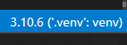

### Python Decorators

A decorator is a special kind of function or class that is used to modify the behavior of another function or class. A decorator takes in a function or class as an argument and returns a modified version of that function or class.

Decorators are typically defined using the @ syntax in Python, and are applied to a function or class by placing the decorator immediately before the function or class definition.

Decorators can be used for a variety of purposes, including:

* Adding or modifying behavior of a function or class
* Wrapping a function or class to provide additional functionality, such as logging or error handling
* Modifying the input or output of a function or class

### Prefect Decorators

Some of the common arguments used in a Prefect @task decorator are:

*name*: The name of the task. This is used for display purposes and for identifying the task in the flow.

automated: A Boolean indicating whether the task should be executed automatically or not.

*log_prints*: Controls whether printed statements within the task should be logged. By default, log_prints is set to False, which means that printed statements within the task will not be logged. If log_prints is set to True, then all printed statements within the task will be logged, allowing you to track the output of the task and debug issues more easily.

*cache_key_fn*: Specifies a custom function for generating the cache key for a Task. The cache key is used to identify whether the result of a Task has been cached or not. By default, Prefect generates a cache key based on the Task name, inputs, and parameters.

*max_retries*: The maximum number of times a task should be retried if it fails.

*retry_delay*: The amount of time to wait before retrying a task if it fails.

*trigger*: The trigger that should be used to determine when the task should be run.

*upstream_tasks*: A list of tasks that should be executed before this task is run.

*on_failure*: A list of tasks that should be executed if this task fails.

*on_success*: A list of tasks that should be executed if this task succeeds.

*state_handlers*: A list of state handlers that should be used to change the state of the task.

*resources*: The resources that this task requires in order to run.

*version*: The version of the task.

These are some of the most common arguments used in a Prefect @task decorator, but there are many others that can be used to configure a task to meet specific needs. By using these arguments, you can customize the behavior of a task to fit your workflow requirements.

There are other Prefect decorators that can have arguments, such as @*flow* and @*step*.

The @*flow* decorator is used to define a flow, which is a collection of tasks that are connected together to form a workflow. The @flow decorator can take arguments such as name, schedule, storage, and environment, among others.

The @*step* decorator is used to define a step in a flow, and can take arguments such as inputs, outputs, and upstream_tasks.

In addition to these decorators, Prefect also provides other decorators such as @retry, @timeout, and @group that can be used to further customize the behavior of tasks and flows.

### Example Ingestion Script

[Simple Ingestion Script](./materials/ingest_data_flow_1.py)

* FLOW is a function-like container of workflow logic
* FLOWS contain TASKs
* TASKs can receive information about upstream dependencies and the state of the dependency
* before runs. This allows tasks to wait on the completion of other tasks
  * Additional Elements: print log, set retries

**Step 1**: Transform ingest_data.py into a Prefect flow. For such, we move all code under if __name__ == '__main__ to a function main_flow(). Then, we use the flow decorator to indicate that main_flow() is a Prefect flow. According to the instructor, a flow consists of a container for workflow logic that we can use to interact and understand the state of the workflow. They receive inputs, perform a set of tasks and returns outputs. In addition, we use the @task decorator to indicate that ingest() is a task from our flow. See [ingest_data_flow_1.py](./work/ingest_data_flow_1.py). Then, we run this new code:

```bash
python ingest_data_flow_1.py
```

Which generates

```bash
17:51:40.362 | INFO    | prefect.engine - Created flow run 'platinum-gopher' for flow 'Ingest Data'
17:51:40.507 | INFO    | Flow run 'platinum-gopher' - Created task run 'extract-bb1266fe-0' for task 'extract'
17:51:40.508 | INFO    | Flow run 'platinum-gopher' - Executing 'extract-bb1266fe-0' immediately...
17:51:41.468 | INFO    | Task run 'extract-bb1266fe-0' - Finished in state Completed()
17:51:41.493 | INFO    | Flow run 'platinum-gopher' - Created task run 'transform-a7d916b4-0' for task 'transform'
17:51:41.493 | INFO    | Flow run 'platinum-gopher' - Executing 'transform-a7d916b4-0' immediately...
17:51:41.531 | INFO    | Task run 'transform-a7d916b4-0' - pre: missing passenger count: 26726
17:51:41.611 | INFO    | Task run 'transform-a7d916b4-0' - post: missing passenger count: 0
17:51:41.635 | INFO    | Task run 'transform-a7d916b4-0' - Finished in state Completed()
17:51:41.659 | INFO    | Flow run 'platinum-gopher' - Created task run 'load-60b30268-0' for task 'load'
17:51:41.659 | INFO    | Flow run 'platinum-gopher' - Executing 'load-60b30268-0' immediately...
17:52:58.989 | INFO    | Task run 'load-60b30268-0' - Finished in state Completed()
17:52:59.015 | INFO    | Flow run 'platinum-gopher' - Finished in state Completed('All states completed.')
```

**Step 2**: transform the script into ETL. Currently, the code performs everything all at once. We can break ingest() into three different tasks: Extract (E), Transform (T) and Load (L). See [ingest_data_flow_etl.py](./work/ingest_data_flow_etl.py) and [ingest_data_flow.py](./materials/ingest_data_flow.py). The flow decorated method coordinates the tasks.

*Parametrization* is the process of defining a flow that can be executed with different input parameters. This allows you to run the same flow multiple times with different inputs, making it easier to manage and reuse your workflows.

*Subflows* refer to the ability to define a flow as a reusable component that can be used as a task within another flow. Subflows can be used to encapsulate complex workflows or to define reusable components that can be reused across multiple flows.

Create a subflow by using the @*flow* decorator to define a flow and then using the Flow class to instantiate a task from the flow. This task can then be added to another flow just like any other task.


```python
@flow(name='Ingest Data')
def main_flow(args):
    url = args.url
    raw_data = extract(url)
    data = transform(raw_data)
    load(user, password, host, port, db, table_name, data)
```

Since tasks may be run multiple times you can improve performance with *caching*

```python
  from prefect.tasks import task_input_hash
  from datetime import timedelta

  @task(log_prints=True, tags=["extract"], cache_key_fn=task_input_hash, cache_expiration=timedelta(days=1))
```

Tasks are just functions and so therefore can be parameterized, for example making the table name

```python
# define a flow that takes a string parameter
@flow(name="Ingest Data")
def main_flow(table_name: str = "yellow_taxi_trips"):
    csv_url = "https://github.com/DataTalksClub/nyc-tlc-data/releases/download/yellow/yellow_tripdata_2021-01.csv.gz"
    log_subflow(table_name)

if __name__ == '__main__':
    # pass the name of the table to the main_flow task
    main_flow(table_name="yellow_trips")
```
### Prefect Orion

**Step 4**: we can use *prefect orion* to view our workflows and define configuration external to the script.

Prefect Orion UI allows us to see our flows in an interactive an intuitive web interface. It summarizes the state of our workflows. Besides, we also have some extra information, such as:

Task Run Concurrency, which can be configured by adding tags to tasks.

Notifications, that alerts us when something goes wrong.

Blocks, which allows us to store configurations and use them as an interface for interacting with external systems. In other words, we can securely store authentication credentials for different services, without the need to specify such credentials directly in our codes or command lines.

```bash
prefect config set PREFECT_API_URL="http://127.0.0.1:4200/api"
prefect orion start
```
#### Blocks

Create a new block for our PostgreSQL connector. In Prefect Orion UI, we first click in "Blocks" and then "Add Block +". Next, we add a SQLAlchemyConnector, and fill the corresponding form as follows and click on "Create". This one uses single thread postgres-psycopy2

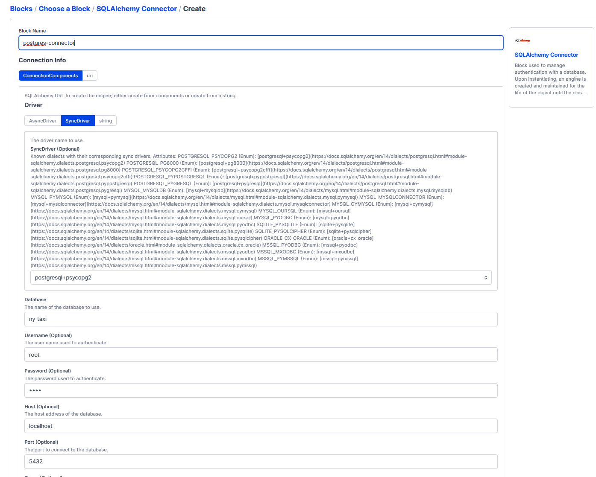

**Step 6**: use the block in the code using this snippet (see [ingest_data_flow_etl_with_sql_block.py](./work/ingest_data_flow_etl_with_sql_block.py))

```python
from prefect_sqlalchemy import SqlAlchemyConnector

with SqlAlchemyConnector.load("postgres-connector") as database_block:
    with connection_block.get_connection(begin=False) as engine:
    df.head(n=0).to_sql(name=table_name, con=engine, if_exists='replace')
    df.to_sql(name=table_name, con=engine, if_exists='append')
```

[Integrations](http://docs.prefect.io/collections/catalog) are organized into collections of pre-built tasks, flows, blocks and more that are installable as PyPI packages.

## 2.2.3 ETL with GCP and Prefect
[DE Zoomcamp 2.2.3 - ETL with GCP & Prefect](https://www.youtube.com/watch?v=W-rMz_2GwqQ&list=PL3MmuxUbc_hJed7dXYoJw8DoCuVHhGEQb&index=20)


Start your venv that you created with the contents of requirements.txt

```bash
. ./zoomcamp/bin/activate
```

In a separate terminal window (using the same venv) start orion server (you must do this as this is is panda's run time environment)

```bash
prefect config set PREFECT_API_URL="http://127.0.0.1:4200/api"
prefect orion start
```

See [etl_web_to_gcs.py](./materials/etl_web_to_gcs.py) for code that performs the load into GCP

Set retries with steps that have connections (that might fail)

```python
@task(retries=3)
```

Given the path to the file write it to Google Cloud Storage bucket. This assumes you've [setup](week1/week1_notes2.md) a GCP account, your GCP tools, and setup local authentication.

Navigate to your GCP Project, then Google Cloud Storage > Buckets. Create a new bucket. The name has to be GLOBALLY unique (not just to your project). This can also be done from the command line. In this example I created "gffurash-prefect-de-zoomcamp"

Prefect *blocks* yet you store reusable configuration information. Where Orion is already running, add the block elements for Google cloud.

```bash
prefect block register -m prefect_gcp
```

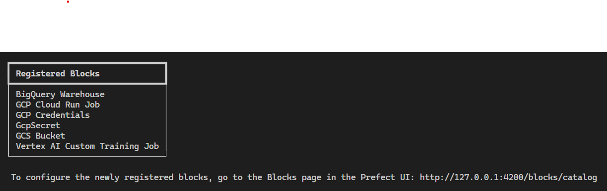

Navigate to your [Orion Server](http://http://127.0.0.1:4200/) and go to Blocks and select GCS Bucket +. When creating the bucket add credentials to access via your service account.

If you haven't created service account yet, go to Google Cloud > IAM & Admin > Service Accounts and Create Service Account. Give it roles (at minimum) BigQuery Admin and Cloud Storage > StorageAdmin. On the row click Keys and Create New Key in JSON format. This document shouldn't be stored in a public repository.

Once you've downloaded the JSON file open it up and cut and paste the contents into a new GCS Credentials block.

```python
from prefect_gcp import GcpCredentials
gcp_credentials_block = GcpCredentials.load("zoom-gcp-creds")
```

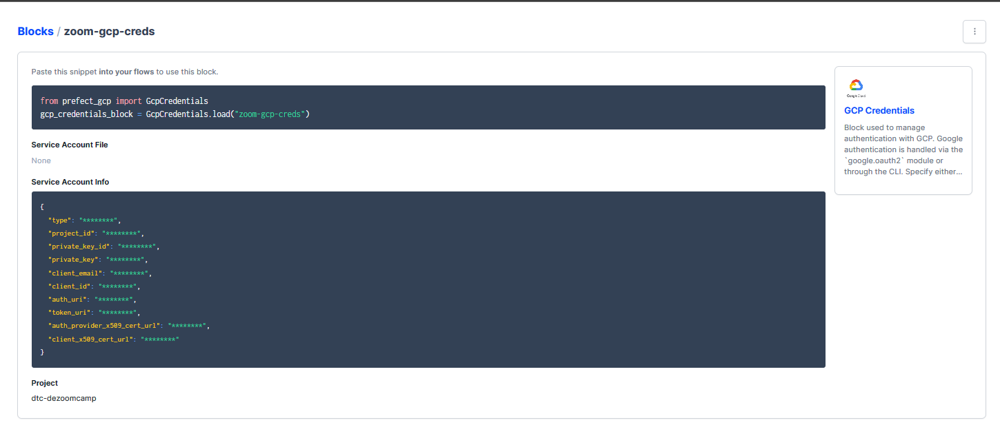

Create a new GCS Bucket block and reference the GCS Credentials block.

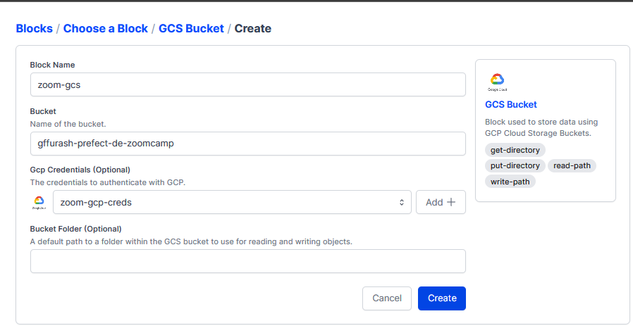

```python
from prefect_gcp.cloud_storage import GcsBucket
gcp_cloud_storage_bucket_block = GcsBucket.load("zoom-gcs")
```

Reference that block in your code

```python
@task()
def write_gcs(path: Path) -> None:
    """Upload local parquet file to GCS"""
    gcs_block = GcsBucket.load("zoom-gcs")
    gcs_block.upload_from_path(from_path=path, to_path=path)
    return
```

On execution you will get something like this

```bash
15:48:58.370 | INFO    | Flow run 'neon-wren' - Created task run 'write_gcs-1145c921-0' for task 'write_gcs'
15:48:58.370 | INFO    | Flow run 'neon-wren' - Executing 'write_gcs-1145c921-0' immediately...
15:48:58.469 | INFO    | Task run 'write_gcs-1145c921-0' - Getting bucket 'gffurash-prefect-de-zoomcamp'.
15:48:58.848 | INFO    | Task run 'write_gcs-1145c921-0' - Uploading from PosixPath('data/yellow/yellow_tripdata_2021-01.parquet') to the bucket 'gffurash-prefect-de-zoomcamp' path 'data/yellow/yellow_tripdata_2021-01.parquet'.
15:49:03.748 | INFO    | Task run 'write_gcs-1145c921-0' - Finished in state Completed()
15:49:03.776 | INFO    | Flow run 'neon-wren' - Finished in state Completed('All states completed.')
```
and the file is now in cloud_storage

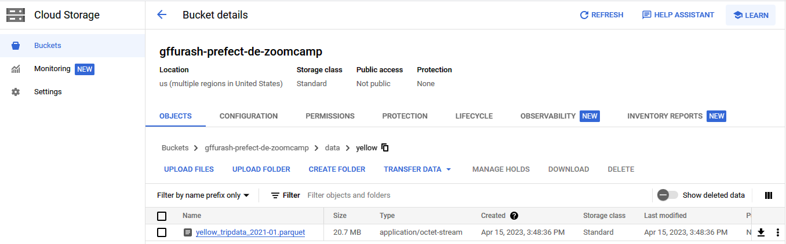

## 2.2.4 From Google Cloud Storage to Big Query

[2.2.4 From Google Cloud Storage to Big Query](https://www.youtube.com/watch?v=Cx5jt-V5sgE&list=PL3MmuxUbc_hJed7dXYoJw8DoCuVHhGEQb&index=22)

Moving from Data Lake (Google Cloud Storage) to Data Warehouse (Big Query)

### Setup Google BigQuery Target Table

Create a table to load the data into in Google Big Query using an existing Parquet file.

BigQuery > + Add Storage > + Google Cloud Storage. Reference the existing GCS bucket and create a data source

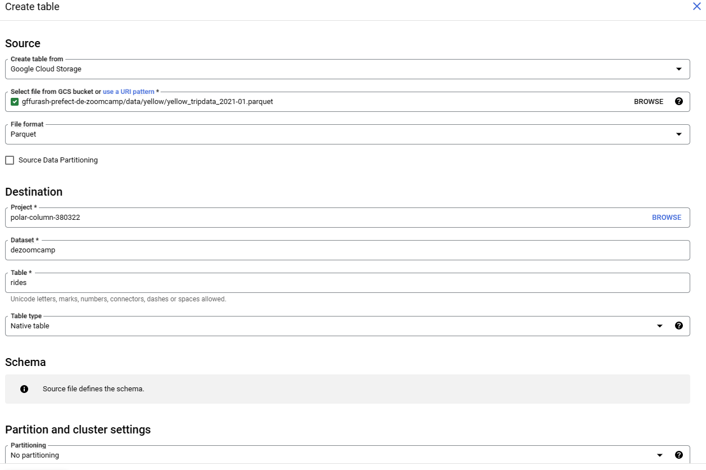

This starts a load job which will build a table based on the sample dataset loaded

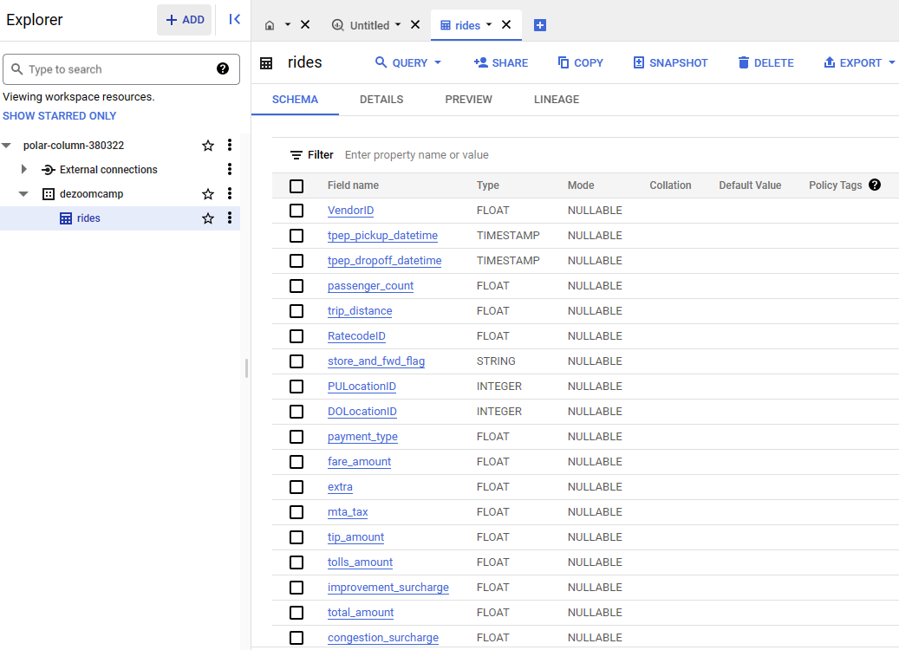

Now delete the data since it was only used to create the table (using the Query tab)

```sql
DELETE FROM `polar-column-380322.dezoomcamp.rides` WHERE true
```

### Load data into BigQuery

See [etl_gcs_to_bq.py](./materials/etl_gcs_to_bq.py)

Note all reference are based on the bucket definition in Orion - that's how the script knows information about the account and GCS location (e.g., zoom-gcs - there isn't any name "zoom-gcs" in the Google cloud account).

Retrieving from GCS - this actually downloads it to the current directory.

```python
@task(retries=3)
def extract_from_gcs(color: str, year: int, month: int) -> Path:
    """Download object from GCS storage and return path to it"""
    gcs_path = f"data/{color}/{color}_tripdata_{year}-{month:02}.parquet"
    gcs_block = GcsBucket.load("zoom-gcs")
    gcs_block.get_directory(from_path=gcs_path, local_path=f"../data/")
    return Path(f"../data/{gcs_path}")
```

Convert parquet file to DataFrame and cleanup null values

```python
@task()
def transform(path: Path) -> pd.DataFrame:
    """Data cleaning example"""
    df = pd.read_parquet(path)
    print(f"pre: missing passenger count: {df['passenger_count'].isna().sum()}")
    df["passenger_count"].fillna(0, inplace=True)
    print(f"post: missing passenger count: {df['passenger_count'].isna().sum()}")
    return df
```

```python
@task()
def write_bq(df: pd.DataFrame) -> None:
    """Write DataFrame to BiqQuery"""
    gcp_credentials_block = GcpCredentials.load("zoom-gcp-creds")
    # to_gbq is a Pandas method
    df.to_gbq(
        destination_table="dezoomcamp.rides",
        # set the project ID and table to match your Google setup
        project_id="polar-column-380322",
        # retreive the service account credentials sotored in the Prefect block
        credentials=gcp_credentials_block.get_credentials_from_service_account(),
        chunksize=500_000,
        if_exists="append",
    )
```

To run (1) activate the virtual environment built with [reqirements.txt](../materials/requirements.txt), (2) start the Orion server, (3) then in a separate terminal (with environment activated) run python ./../[file.py]

## 2.2.5 Parametrizing Flow & Deployments with ETL into GCS Flow

* [DE Zoomcamp 2.2.5 - Parametrizing Flow & Deployments with ETL into GCS flow](https://www.youtube.com/watch?v=QrDxPjX10iw)
* [Transcript](./week2/materials/03_deployments/Readme.md)
* [parameterized_flow.py](./week2/materials/03_deployments/docker_deploy.py)
* [docker_deploy.py](./week2/materials/03_deployments/docker_deploy.py)
* [Section ReadMe](./materials/03_deployments/README_week2_course.md)

### Parameterizing Flow

Parameterize methods to accept the parameters that will come in from the Prefect deployment

**Requirements**: Orion installed, GCS Setup, Service Account created and added to Orion block, VNV environment built and started, Orion started.

```python
from prefect.tasks import task_input_hash
# if key (context + parameters) of prior call matches completed state, restore state
# instead of running task again
@task(retries=3, cache_key_fn=task_input_hash, cache_expiration=timedelta(days=1))
def fetch(dataset_url: str) -> pd.DataFrame:
    """Read taxi data from web into pandas DataFrame"""
    df = pd.read_csv(dataset_url)
    return df
```

```python
@flow()
def etl_web_to_gcs(year: int, month: int, color: str) -> None:
    """The main ETL function"""
    dataset_file = f"{color}_tripdata_{year}-{month:02}"
    dataset_url = f"https://github.com/DataTalksClub/nyc-tlc-data/releases/download/{color}/{dataset_file}.csv.gz"

    df = fetch(dataset_url)
    df_clean = clean(df)
    path = write_local(df_clean, color, dataset_file)
    write_gcs(path)
```

Create a sub-flow to allow us to iterate through sets of parameters

```python
def etl_parent_flow(
    # these are the default values used if nothign is passed for the parameter
    months: list[int] = [1, 2], year: int = 2021, color: str = "yellow"
):
    for month in months:
        etl_web_to_gcs(year, month, color)
```

Call the sub-flow passing in sets of parameters

```python
if __name__ == "__main__":
    color = "yellow"
    months = [1, 2, 3]
    year = 2021
    etl_parent_flow(months, year, color)
```

### Prefect Deployments

#### Core, Agents and Work Queues

Before running the workflow, let's look at the concepts of Core, Agents and Work Queues

In Prefect, "Work Queues" and "Agents" are key components for executing workflows in a distributed manner.

Prefect Core is the backend component of Prefect, an open-source platform for automating data workflows. Prefect Core provides the building blocks for defining, scheduling, executing, and monitoring data workflows. It provides APIs for creating and manipulating workflows, tasks, and flows. Prefect Core also provides a scheduling engine for executing workflows and a backend for storing and retrieving workflow state and metadata. It forms the backbone of the Prefect platform, providing the necessary infrastructure for executing data workflows and managing their state.

*Work Queue*: is a data structure that holds tasks that are ready to be executed. It acts as a buffer between the Prefect Core and the agents, allowing the Core to manage tasks while the agents execute them.

*Agent* is a piece of software that pulls tasks from the work queue and executes them. Agents can run on a variety of platforms, including local machines, cloud infrastructure, or containers. They can be deployed in a single node or in a cluster, and they work together to process the tasks in the work queue.

Agents and work queues allow Prefect to scale and distribute the execution of workflows, improving performance and reliability. This makes it possible to process large amounts of data or perform complex computations in a parallel and distributed manner, increasing the overall efficiency and reducing the time it takes to complete a workflow.

#### Stages in a workflow

Here's a general timeline of how a Prefect workflow is executed:

Workflow Definition: The first step is to define the workflow using the Prefect API. The workflow consists of a directed acyclic graph (DAG) of tasks and the relationships between them.

Task Assignment: Once the workflow is defined, Prefect Core assigns tasks to the work queue. This is done based on the relationships between the tasks and the state of each task.

Task Pulling: Agents pull tasks from the work queue and execute them. When an agent pulls a task, it marks the task as "running" in the Prefect Core.

Task Execution: The agent executes the task by running the code associated with it. The agent reports the result of the task execution back to the Prefect Core.

Task Completion: If the task execution is successful, the agent marks the task as "successful" in the Prefect Core. If the task execution fails, the agent marks the task as "failed".

Task Flow: The result of each task execution is used to determine the next task in the workflow. The Prefect Core updates the state of the tasks based on the result and assigns the next task to the work queue.

Repeat: The process repeats until all tasks in the workflow are complete.

At each stage of the workflow execution, work queues and agents play an important role in ensuring the efficient and reliable execution of the workflow. The work queue holds tasks that are ready to be executed and acts as a buffer between the Prefect Core and the agents. The agents pull tasks from the work queue, execute them, and report the results back to the Prefect Core, allowing the Core to manage tasks while the agents execute them. This allows Prefect to scale and distribute the execution of workflows, improving performance and reliability.

#### Deployments

**Deployment**: Server-side concept that encapsulates a flow, allowing it to be scheduled and triggered via API.

* Stores metadata about where your flow's code is stored and how your flow should be run.
* References a single "entry point" flow
* Can have Multiple deployments (w/ different settings) for the same flow (e.g., test/prod)
* Allows you to schedule and specify infrastructure and location of code
* a configuration for managing flows, whether you run them via the CLI, the UI, or the API

[Deployment Tutorial](https://docs.prefect.io/latest/tutorials/deployments/)

This example using building via the CLI specifying the flow code, entry point, and name

```bash
prefect deployment build ./parameterized_flow.py:etl_parent_flow -n "Parameterized ETL"
```

```bash
Found flow 'etl-parent-flow'
Default '.prefectignore' file written to /home/garyf/repos/prefect-zoomcamp/flows/03_deployments/.prefectignore
Deployment YAML created at '/home/garyf/repos/prefect-zoomcamp/flows/03_deployments/etl_parent_flow-deployment.yaml'.
Deployment storage None does not have upload capabilities; no files uploaded.
```

Add the parameters to the yaml file:  `parameters: { "color": "yellow", "months" :[1, 2, 3], "year": 2021} ` (this can also be done in the UI)

Now we need to apply the deployment: `prefect deployment apply etl_parent_flow-deployment.yaml`. This SENDS the metadata to the Prefect API (Orion Server)

```bash
Successfully loaded 'Parameterized ETL'
Deployment 'etl-parent-flow/Parameterized ETL' successfully
created with id '2882c544-bf8c-4edc-9787-5f9358169138'.
View Deployment in UI: http://127.0.0.1:4200/deployments/deployment/2882c544-bf8c-4edc-9787-5f9358169138
To execute flow runs from this deployment, start an agent that pulls work from the 'default' work queue:
$ prefect agent start -q 'default'
```

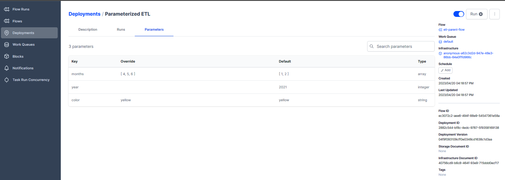

You can set a schedule for the Deployment (e.g., in the UI)

**Run**: instance of the Flow (specific parameters & execution)

**Agent**: lightweight python process that lives in the execution environment. The agent polls from 1:M work queues.

The work queue shows *unhealthy* because you need to start an agent - a lightweight process that polls that work queue for scheduled runs. You MUST have an agent running to get it to do anything.

In order to get it to run, modify the script to deal with the fact that even though the script flow (py file) is SOURCED from a specific local directory, it's actually run by Prefect in a temp directory.

You can run the flow directly from the UI.

```python
import os
from prefect import get_run_logger

def write_local(df: pd.DataFrame, color: str, dataset_file: str) -> Path:
    """Write DataFrame out locally as parquet file"""
    path = Path(f"data/{color}/{dataset_file}.parquet")
    logger = get_run_logger()
    """
    Even though the deployment definition yaml gets the script from a specific
    location like this at run time
        path: /home/garyf/repos/prefect-zoomcamp/flows/03_deployments
        entrypoint: parameterized_flow.py:etl_parent_flow
    prefect RUNs the script from a temporary directory like this
        /tmp/tmp_edkvy1kprefect
    Since that is the new root directory you need to make sure any subdirectories
    you need exist.
    """
    # for the relative reference
    if not os.path.exists(f"data/{color}"):
        logger.info("Creating target directory")
        os.makedirs(f"data/{color}")
    df.to_parquet(path, compression="gzip")
    return path
```

You can create notifications based on the execution state, like failed or crashed (infrastructure failure).

## DE Zoomcamp 2.6 - Schedules & Docker Storage with Infrastructure

**Current Startup Steps**

```bash
# start docker if not started
if [ -n "`service docker status | grep not`" ]; then
    sudo /usr/sbin/service docker start
fi
# enter the python environment built with requirements.txt (includes prefect, gcp)
$ source /home/garyf/repos/prefect-zoomcamp/zoomcamp/bin/activate
# start prefect / orion
$ prefect config set PREFECT_API_URL=http://127.0.0.1:4200/api
$ prefect orion start
# start the prefect default agent to run jobs
$ prefect agent start -q 'default'
```

**Topics**

* Scheduling a deployment
* Flow code storage
* Running tasks in Docker

**Links**

* :movie_camera: [DE Zoomcamp 2.2.6 - Schedules & Docker Storage with Infrastructure](https://www.youtube.com/watch?v=psNSzqTsi-s&list=PL3MmuxUbc_hJed7dXYoJw8DoCuVHhGEQb)

### Scheduling a deployment

Flows w/in Deployments can be scheduled via the Orion UI. Deployments > Edit > Add Schedule. Schedules can also be defined in a deployment. ```prefect deployment build --help``` explains these command line options.

``` bash
$ prefect deployment build /flows/03_deployments/parameterized_flow.py:etl_parent_flow -n "Parameterized Flow Chron" --chron "*0 0 * * *" -a
# or after the fact
$ prefect deployment --set-schedule --chron "*0 0 * * *" -a
```

### Running tasks in Docker Containers

Reminder: docker files must be named (case sensitive) *Dockerfile* and you must run ```docker image build``` from the same location

Goal is to put flow code in some shareable, reusable place, along with everything they need to run (e.g., PIP). We will be putting it in a Docker container and put that on docker hub.

Create a *Dockerfile* (text file) base image

*Dockerfile*

```Dockerfile
# start with prefect as the base image, which uses python slim image as base image
FROM prefecthq/prefect:2.7.7-python3.9
# copy python venv setup, don't need prefect
COPY docker-requirements.txt .
# install the requirements
RUN pip install -r docker-requirements.txt --trusted-host pypi.python.org --no-cache-dir
# copy flows folder into flows directory
COPY flows /opt/prefect/flows
# create data directory relative to the code to store the files
RUN mkdir -p /opt/prefect/data/yellow
```

*docker-requirements.txt*

```
pandas==1.5.2
prefect-gcp[cloud_storage]==0.2.4
protobuf==4.21.11
pyarrow==10.0.1
pandas-gbq==0.18.1
```

After creating a [Dockerhub](https://hub.docker.com/repositories/pencilboy99), build the image above on dockerhub

```bash
# sign into dockerhub with your credentials
$ docker login -u "pencilboy99"
Login Succeeded
# build the image
$ docker image build -t pencilboy99/prefect:zoom .
=> => naming to docker.io/pencilboy99/prefect:zoom
# push the image to dockerhub
$ docker image push pencilboy99/prefect:zoom
```

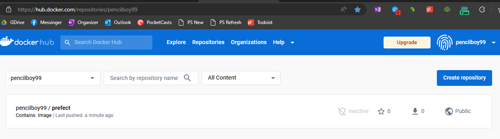

Add a Docker Block to Prefect so that Prefect can access dockerhub

1. Navigate to [Prefect Orion](http://127.0.0.1:4200/flow-runs)
2. Blocks + button
3. Docker Container, Add +
4. Image = pencilboy99/prefect:zoom
5. Create button

This returns a snippet that can be used in a script to build the deployment that now references the docker container on dockerhub instead of your local environment and script.

```python
from prefect.infrastructure.docker import DockerContainer
docker_container_block = DockerContainer.load("zoom")
```

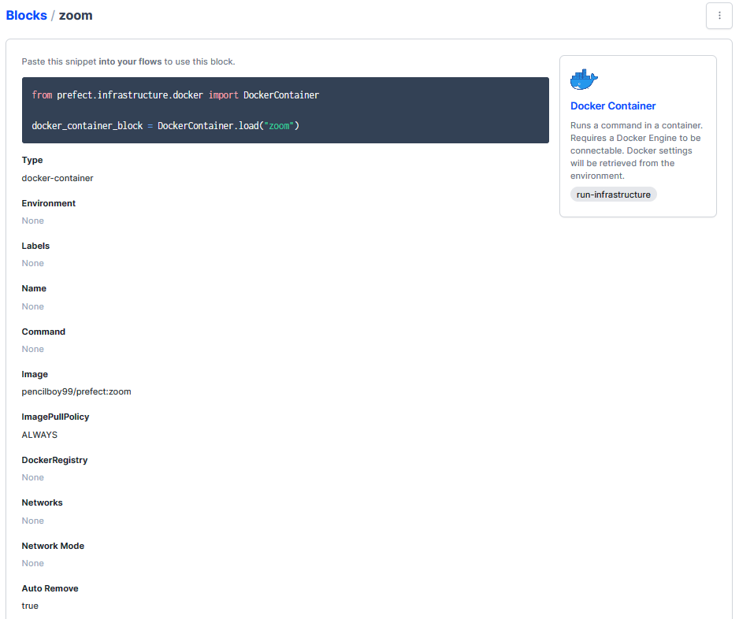

You could also make the block via a script

```python
from prefect.infrastructure.docker import DockerContainer
docker_block = DockerContainer(
    image="pencilboy99/prefect:zoom",  # insert your image here
    image_pull_policy="ALWAYS",
    auto_remove=True,
)
docker_block.save("zoom", overwrite=True)
```

Then build the deployment using the block above in a script [parameterized_flow.py](./materials/flows/03_deployments/docker_deploy.py)

```python
from prefect.deployments import Deployment
from parameterized_flow import etl_parent_flow
from prefect.infrastructure.docker import DockerContainer

docker_block = DockerContainer.load("zoom")

docker_dep = Deployment.build_from_flow(
    flow=etl_parent_flow,
    name="docker-flow",
    infrastructure=docker_block, # this uses a block to reference your environment
)

if __name__ == "__main__":
    docker_dep.apply()
```

Then ```python flows/03_deployment/docker_deploy.py`` which creates a deployment on the running Prefect Orion server.

You need to setup an API for your current workspace so that your Orion server can interact with the docker container. Prefect profiles allow you to specify specific API. ``prefect profile ls`` (which initially returns * default) shows the workspace you are using. Set a specific API for your current workspace (in this example to local instance) with```prefect config set PREFECT_API_URL="http://127.0.0.1:4200/api``` (returns ```Updated profile 'default'```).

To run form command line ```prefect deployment run etl-parent-flow/docker-flow```

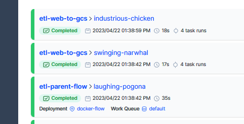

## Homework Notes

You can log Print statements within functions in Prefect via ```(log_prints=True)```

```-> {variable type}``` is a decorator that describes the return type of the function (you still need to ```return {variable}```)

[Homework Assignment 3](./work/homework_3.py)