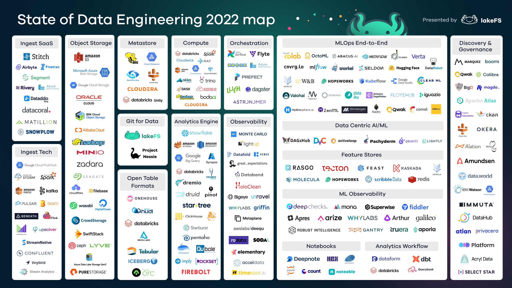

# Week 2 Notes

* Data Lake
* Workflow orchestration
* Introduction to Prefect
* ETL with GCP & Prefect
* Parametrizing workflows
* Prefect Cloud and additional resources
* Homework

**Links**

* [Week 2 Prefect](https://github.com/discdiver/prefect-zoomcamp)
* [transcript with code for the second Prefect video](https://github.com/discdiver/prefect-zoomcamp/tree/main/flows/01_start)
* [fifth Prefect video](https://github.com/discdiver/prefect-zoomcamp/tree/main/flows/01_start)

## Data Lake

[DE Zoomcamp 2.1.1 - Data Lake](https://www.youtube.com/watch?v=W3Zm6rjOq70&list=PL3MmuxUbc_hJed7dXYoJw8DoCuVHhGEQb)

### What is a Data Lake

Goal: make data as accessible as possible as quickly as possible, particularly non-standard data sources

* Contains data from multiple sources
* Contains data of multiple types (structured, unstructured, semi-structured)
* Includes metadata as data is added (Index and Catalog)
* Highly scalable, Inexpensive hardware


| Area          | Data Lake                             | Data Warehouse                 |
| ------------- | ------------------------------------- | ------------------------------ |
| *Data Format* | Raw data in multiple formats          | Highly structured cleaned data |
| *Users*       | Data Scientists, Machine Learning     | Business, Analysts             |
| *Volume*      | Massive volumes                       | Curated volumes                |
| *Speed*       | Very fast (no design time, streaming) | Normal business cycle          |

### ETL vs ELT

| ELT                        | ETL                       |
| -------------------------- | ------------------------- |
| Extract Load and Transform | Export Transform and Load |
| Massive volumes            | Smaller volumes           |
| *Schema on Read* (source)  | Pre-defined target schema |
| Lake                       | Warehouse                 |

### Risks

* Data swamp (no versioning, inconsistent schemas)
* Joins are difficult (quality, structure)

### Providers

| Provider | Product       |
| -------- | ------------- |
| GCP      | Cloud Storage |
| AWS      | S3            |
| Azure    | Azure Blob    |

## State of Data Engineering



## Introduction to Workflow Orchestration

[Introduction to Workflow Orchestration](https://www.youtube.com/watch?v=8oLs6pzHp68&list=PL3MmuxUbc_hJed7dXYoJw8DoCuVHhGEQb&index=18)

* Governing your data flow in a way that respects coordination rules
* Orchestration tools let you turn code into a workflow that can be scheduled and observed
* Delivery System Analogy
  * Products in Boxes = Tasks in Workflow
  * Order in Cart = Workflow. Do they get delivered all at once, sequentially, independently, parallelization, concurrency and asynch
  * Delivery = Workflow Orchestration. Schedule, scaleable, guaranteed despite issues, observable, secured

## Introduction to Prefect Concepts

[Introduction to Prefect Concepts](https://www.youtube.com/watch?v=cdtN6dhp708&list=PL3MmuxUbc_hJed7dXYoJw8DoCuVHhGEQb&index=19)

[Code Examples](https://github.com/discdiver/prefect-zoomcamp)

Prefect is a Python based Orchestration Framework

Install python packages from file in *[package]=[version]* format

```bash
pip install -r requirements.txt
```