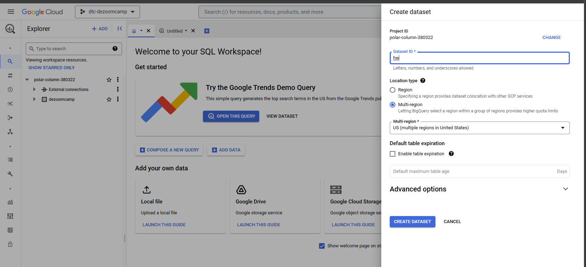

# Week 3 Homework Notes

[Homework Instructions](../materials/homework.md)
[Homework Solution](https://www.youtube.com/watch?v=j8r2OigKBWE)

## Load the Data into GCS Cloud Storage

Use [week_3_h1.py](week_3_h1.py) to load the data after setting environment variables.

```bash
$ . setenv
$ python week_3_h1.py
```

Navigate to GCS Storage > Buckets > Configuration and fetch the URI

```
gs://gffurash-prefect-de-zoomcamp/data/flv/flv_tripdata_2019-01.csv.gz
```

Navigate to GCS > Big Query and at the root of your project create a dataset (```hw```)



Create the external table referencing ```[your project].[dataset].[table name]```

```SQL
CREATE OR REPLACE EXTERNAL TABLE `polar-column-380322.hw.fhv_external_table`
OPTIONS (
  format = 'CSV',
  uris = ['gs://gffurash-prefect-de-zoomcamp/data/fhv/*.csv.gz']
);
```

It should return ```This statement created a new table named fhv_external_table.```

Then create the materialized table based on that external table

```SQL
CREATE OR REPLACE TABLE `polar-column-380322.hw.fhv_materialized_table`
AS
(
    SELECT * FROM polar-column-380322.hw.fhv_external_table
)
```