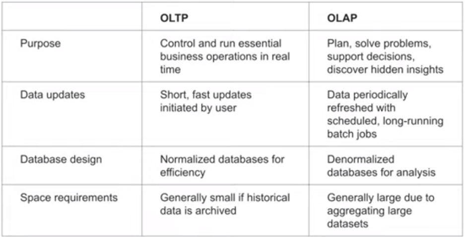
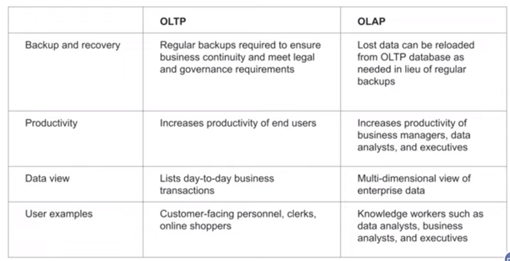
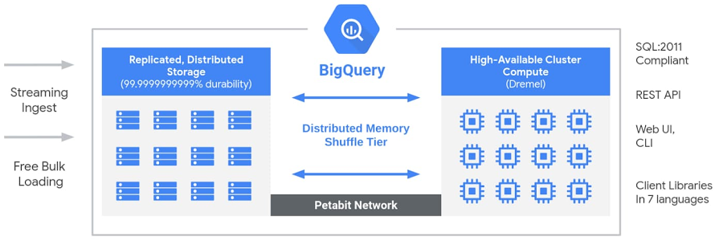
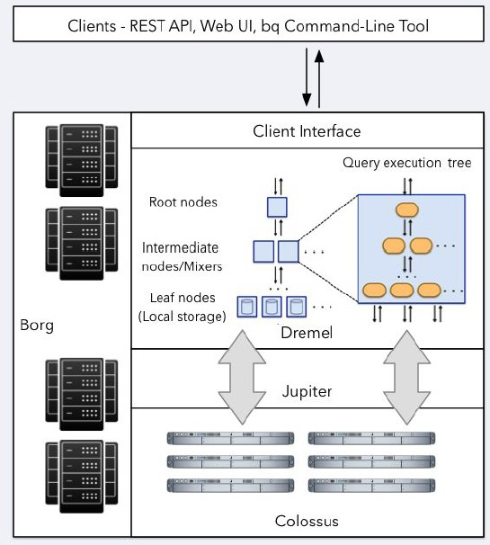

# Week 3 - Data Warehouse

* Data Warehouse
* BigQuery
* Partitioning and clustering
* BigQuery best practices
* Internals of BigQuery
* Integrating BigQuery with Airflow
* BigQuery Machine Learning

## Reference & Links

[Week 3 ReadMe](./materials/ReadMe.md)
[Video 3.1.1](https://www.youtube.com/watch?v=jrHljAoD6nM&list=PL3MmuxUbc_hJed7dXYoJw8DoCuVHhGEQb&index=25)
[Big Query SQL](./materials/big_query.sql)
[Video 3.1.1](https://www.youtube.com/watch?v=-CqXf7vhhDs&list=PL3MmuxUbc_hJed7dXYoJw8DoCuVHhGEQb&index=26)
[Video 3.1.2](https://www.youtube.com/watch?v=k81mLJVX08w&list=PL3MmuxUbc_hJed7dXYoJw8DoCuVHhGEQb&index=27)
[Video 3.2.3](https://www.youtube.com/watch?v=eduHi1inM4s&list=PL3MmuxUbc_hJed7dXYoJw8DoCuVHhGEQb&index=28)

## 3.1.1 Data Warehouse and BigQuery

BigQuery is our example Data Warehouse.

### Overview

*OLAP VS OLTP:*




Data Warehouse Structure:

* [1:M] Data Sources
  * -> Staging Area
    * -> Warehouse Structures
      * -> Data Marts
      * -> End Users
      * -> Machine Learning

BigQuery advantages are:
  * serverless + embedded infrastructre (scalable)
  * built in machine learning, geospatial analysis

By default CACHES queries

Creating external table *referring* to a Google Cloud Storage bucket. Schema is defined on write.

```sql
CREATE OR REPLACE EXTERNAL TABLE `taxi-rides-ny.nytaxi.external_yellow_tripdata`
OPTIONS (
  format = 'CSV',
  uris = ['gs://nyc-tl-data/trip data/yellow_tripdata_2019-*.csv', 'gs://nyc-tl-data/trip data/yellow_tripdata_2020-*.csv']
);
```

### Partitioning & CLustering

Select *partition* rule based on most common *filter* columns -> improves performance and scalablility by reading less data. Patitioning "under the covers" creates multiple storage locations based on the rule (where all data matching the rule resides).

```sql
-- Create a non partitioned table from external table
CREATE OR REPLACE TABLE taxi-rides-ny.nytaxi.yellow_tripdata_non_partitoned AS
SELECT * FROM taxi-rides-ny.nytaxi.external_yellow_tripdata;

-- Create a partitioned table from external table
CREATE OR REPLACE TABLE taxi-rides-ny.nytaxi.yellow_tripdata_partitoned
PARTITION BY
  DATE(tpep_pickup_datetime) AS
SELECT * FROM taxi-rides-ny.nytaxi.external_yellow_tripdata;
```

*Clustering* groups data by columns within a partition.

```sql
-- Creating a partition and cluster table. In this example we usually use
-- VendorID as a 2nd filter
CREATE OR REPLACE TABLE taxi-rides-ny.nytaxi.yellow_tripdata_partitoned_clustered
PARTITION BY DATE(tpep_pickup_datetime)
CLUSTER BY VendorID AS
SELECT * FROM taxi-rides-ny.nytaxi.external_yellow_tripdata;
```

## 3.1.2 Partitioning and Clustering

< 1 GB Partitioning and Clustering don't help

Partitioning

* Time Unit Columns
* Ingestion Time (_PARTITIONTIME)
  * Daily/hourly/monthly/yearly - choose course grain first
  * Max number of Partitioning 4000 / table - use *expire*
* Integer Range Partitioning
* Allows management (e.g., dropping)

Clustering

* Columns co-locate location
* Determines sort order in column sequence
* Max 4 columns - top-level, not-repeated

When to Cluster vs Partition

* Choose when more filters and granularity needed
* Partitioning would provide too small sections (1 GB)
* Partitioning would create too many partitions
* Updates frequently modify MANY partition

Auto Re-Clustering

* Writes are often to blocks with key ranges not in existing blocks
* BigQuery automatically re-clusters int he background

## 3.1.3 BigQuery Best Practices

[BigQuery Best Practices](https://cloud.google.com/bigquery/docs/best-practices-performance-overview)

### Introduction

BigQuery breakdown of computational capacity into *slots* then lmits based on pricing model.

Price queries before execution looking for ways to reduce # of slots

### Use Nested and Repeated Fields

Denormalize complicated structures, transforming to nested or repeated columns, particularly for parent-child structures read together. Don't use for star schema with frequently changing dimensions.

Child entities are stored "inline" w/ Nesting or Repeated fields. Used complementary

Define

```sql
CREATE TABLE IF NOT EXISTS mydataset.mytable (
  id STRING,
  first_name STRING,
  last_name STRING,
  dob DATE,
  addresses
    ARRAY<
      STRUCT<
        status STRING,
        address STRING,
        city STRING,
        state STRING,
        zip STRING,
        numberOfYears STRING>>
) OPTIONS (
    description = 'Example name and addresses table');
```

**Nesting (STRUCT Type)**
Query, w/ properties referenced via '.' notation or STRUCT function

Max 15 levels of nested RECORD types

```sql
WITH orders AS (
  SELECT STRUCT(STRUCT('Yonge Street' AS street, 'Canada' AS country) AS address) AS customer
)
SELECT t.customer.address.country FROM orders AS t;
```
**Repeated (ARRAY Type)**

Use as long as high cardinality not used

```sql
WITH Items AS (SELECT ["coffee", "tea", "milk"] AS item_array)
SELECT
  item_array,
  item_array[OFFSET(0)] AS item_offset,
  item_array[ORDINAL(1)] AS item_ordinal,
  item_array[SAFE_OFFSET(6)] AS item_safe_offset
FROM Items
```

### Filering and Ordering

* Where Clause Columns
  * Choose BOOL, INT, FLOAT, or DATE columns in the WHERE clause ahead of STRING and BYTE.
* Order Query Operation to Improve Performance
  * Filter before sorting and complex operations
  * Use ORDER BY only in outermost query or *window clause*. You want to FILTER before you SORT.
  * Push complex operations (e.g., regular expressions) to the end of the query

### Reduce Data Processed in Queries

* Avoid ```SELECT *```, particularly when using a columnar store
* Partition and then explicitly select partition
  * Use the _PARTITIONDATE or _PARTITIONTIME pseudo-columns ```WHERE _PARTITIONDATE='2017-01-01'```
```sql
WHERE _PARTITIONTIME
BETWEEN TIMESTAMP("2016-01-01")
    AND TIMESTAMP("2016-01-31")
```
* Use time-partitioned tables instead of sharding (tables with suffix)
* Reduce data before JOIN with a CTE that filters the data or preforms aggregations

### Optimize Query Computation

* Avoid repeatedly transforming data in SQL queries
  * Instead materials the results 1 time
* Optimize JOIN order
  * START with the largest table in the JOIN sequence (typically)
* Use INT64 data types in JOINS instead of STRINGS
  * BigQuery does not index primary keys so wider JOIN columsn take more time
* Avoid using the same CTE multiple times
  * Instead store in temporary table or scalar variable
* Split large queries into multiple queries
  * Instead store in temporary table or scalar variable

### Manage Query Outputs

Seek to reduce the amount of data written

* *Avoid* repeated joins and subqueries
  * *Instead* denormalize schema, materialize subquery results

### SQL Anti-Patterns

* *Avoid* self-joins and *instead* use *window functions
* Manage *data skew*
  * *Data Skew*: keys w/ values that aren't evenly distributed. If using partitioning this can cause *partition skew*
    * Example: user_id w/ many "guest" values
    * Detect: difference between avg/max compute times
  * Fitler data early
  * Unbalanced Joins
    * *Unbalanced Joins* too much data on one side of join going into the same shard
    * Solution: Split into 2 queries or pre-filter rows w/ table with skew
    * Solution: fitler using IN/NOT IN where clause and SELECT DISTINCT <key with skew>
  * Avoid Cross Joins
    * Instead pre-aggregate data or window function
  * Avoid DML statements that update single rows
    * Instead batch for BULK updates

## 3.1.4 Internals of Big Query

[BigQuery Overview](https://cloud.google.com/blog/products/data-analytics/new-blog-series-bigquery-explained-overview)

BigQuery is part of Google Cloud’s comprehensive data analytics platform that covers the entire analytics value chain including ingesting, processing, and storing data, followed by advanced analytics and collaboration.

BigQuery’s serverless architecture decouples storage and compute and allows them to scale independently on demand.





Composed of

* Compute: *Dremel*, a large multi-tenant cluster that executes SQL queries.
* Storage: *Colossus*, Google’s global storage system
* Network: Compute and storage talk to each other through the petabit *Jupiter* network
* Orchestration: BigQuery is orchestrated via Borg (Kuberneties-like)

!(BigQuery Runtime)[./images/w3s04.jpg]

BigQuery is Columnar, where data for an individual record is spread across multiple "locations". Dremel breaks down queries into small leaf nodes that execute independently against Colossus.

## 3.2 Machine Learning with Big Query

See [alvas_navaro_notes](./materials/alvaro_navas_notes.md) and [big query ml sql](./materials/big_query_ml.sql.sql)